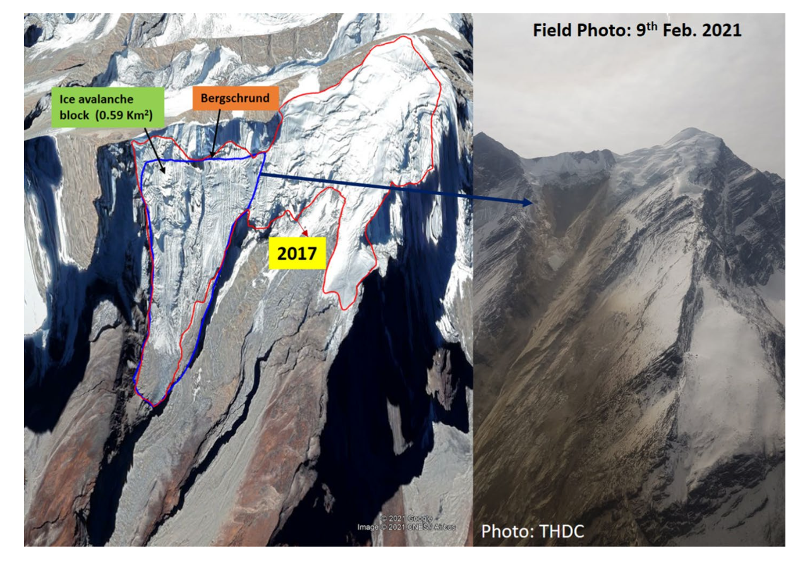

On **7 February 2021**, a catastrophic event struck the Rishiganga and Dhauliganga rivers in Uttarakhand, India. A massive debris flow washed away the Rishiganga hydropower project, damaged the Tapovan-Vishnugad project, and tragically claimed over 100 lives.

In our study, published in **[Natural Hazards](https://doi.org/10.1007/s11069-022-05454-0)**, we conducted a preliminary assessment to answer the critical question: **What triggered this disaster?**

Our analysis identified the source as a **hanging glacier** located on a steep mountain slope (average 35°) at an elevation of 4700–5555 m a.s.l. Specifically, a **0.59 km²** right lobe of the glacier detached, triggering a massive ice-rock avalanche that traveled **12.4 km** before impacting the infrastructure downstream.

<figure class="align-center">
  
  <figcaption>
    <strong>Fig.:</strong> A Hanging glacier in google earth image of 2017. The detached right lobe is marked blue. B Heli photograph of 9 February 2021 of the site showing detachment of the glacier creating an ice-rock avalanche. (Photograph courtesy, THDC).
  </figcaption>
</figure>

---
The disaster wasn't a random accident. Our primary investigation showed that the event was driven by a complex process involving local geology, snow, glacier, permafrost thawing, and recent warming of the local climate.

Permafrost modeling provided a crucial insight. At approximately **40 meters depth**, the ground witnessed a "delayed response" to the 2012–2016 warming trend. This deep warming likely created peak positive temperature conditions by December, facilitating the formation of a **thin film of water** at the glacier base. This water acted as a lubricant, destabilizing the hanging glacier.

The modeling also suggested warm permafrost conditions below 50m, creating favorable conditions for **intense frost cracking** in the upper 10–15 meters of the bedrock, further weakening the slope stability.

## Conclusion and Observation

The Rishiganga disaster highlights the fragility of the Himalayan cryosphere. It is proposed that the recent changes in weather conditions primarily drove this event through a combination of geological, glaciological, and permafrost processes. Permafrost studies, including monitoring of ground surface temperature (GST) and modelling of the ground thermal regime, will provide an early indicator. Permafrost elevations in this area and most of the Indian Himalayan region are not known, which will further aggravate the risk of the high elevation cryosphere region under a warming climate.

This event serves as a wake-up call for the need for **improved monitoring** of the cryosphere to capture early warning signs and ensure better preparedness for downstream communities.

---

  <h4>Read the Full Paper</h4>
  
<strong>Thayyen, R.J., Wani, J.M., et al. (2022).</strong> 
  <em>Hanging glacier avalanche (Raunthigad–Rishiganga) and debris flow disaster on 7 February 2021, Uttarakhand, India: a preliminary assessment.</em> 
  Natural Hazards.

  
  <a href="https://doi.org/10.1007/s11069-022-05454-0" class="btn btn--inverse">View Publication</a>

