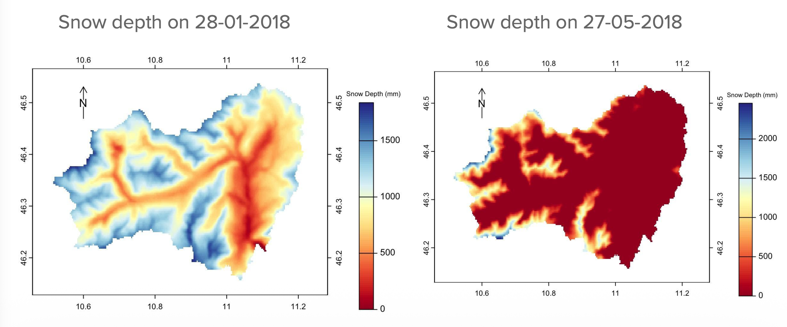

Mountains store water as snow. Understanding when and how much of that snow melts is critical for millions of people downstream for drinking water, irrigation, hydropower, and flood forecasting. Yet modelling snow in complex terrain remains one of the hardest problems in hydrology.

This May, at the [EGU General Assembly 2026](https://www.egu26.eu/) in Vienna, we are offering a **hands-on short course** to help researchers and students get started with two powerful open-source tools for snow-dominated catchments: **[GEOtop](https://github.com/geotopmodel/geotop)** and **[GEOframe](https://github.com/geoframecomponents)**.

---

## What is the Course About?

**Session:** [SC2.20 — Introducing GEOtop and GEOframe](https://www.egu26.eu/session/57905)  
**When:** Friday, 8 May 2026, 16:15–18:00 CEST  
**Where:** Room -2.62, Austria Center Vienna  
**Conveners:** John Mohd Wani, Giacomo Bertoldi, Marialaura Bancheri, Matteo Dall'Amico, Giuseppe Formetta

The course is designed for **researchers, PhD students, and practitioners** who want to start using physically-based hydrological models but find the setup and compilation process daunting. We walk you through everything from installation to interpreting your first simulation results.

---

## What You Will Learn

The GEOtop part covers:

1. **What is GEOtop?**: A physically-based model that couples energy and water balance at and below the land surface, including a multilayer snow scheme, soil freezing, and terrain effects.

2. **Installation on any OS**: Step-by-step instructions for Linux, macOS, and Windows (via WSL). We tested every command live on Ubuntu 24.04 with GCC 13.3 and CMake 3.28.

3. **Running your first simulation**: Understanding the directory structure, the `geotop.inpts` configuration file, meteorological forcing format, and output files.

4. **Hands-on output analysis**: A Jupyter notebook that reads GEOtop output and produces publication-quality plots of snow depth, SWE, energy balance, precipitation partitioning, snow density evolution, and more.

---

## Why GEOtop?

GEOtop solves the **full surface energy balance**. It doesn't use a simple degree-day approach. This means it can capture processes that simpler models miss: radiation effects in complex terrain, the thermal state of the snowpack (cold content vs. isothermal ripening), and the coupled dynamics of soil freezing and thawing.

It's not the easiest model to set up and that's precisely why this course exists. Our goal is to lower the entry barrier so that more researchers in the snow and permafrost community can benefit from physically-based modelling.

---

## How to Prepare

To make the most of the hands-on session, please come with:

- A laptop with **git**, **CMake** (or Meson), and a **C++ compiler** installed
- **Windows users**: install [WSL2 with Ubuntu](https://learn.microsoft.com/en-us/windows/wsl/install) beforehand
- A **conda environment** for the Jupyter notebook:

```bash
conda create -n geotop_course python=3.11 pandas matplotlib numpy jupyterlab -c conda-forge -y
```

Don't worry if you can't compile before the session, we'll walk through it together.

---

## Course Material

All materials are open-access under a **CC BY 4.0** license:

| Material | Description | Link |
|----------|-------------|------|
| **Presentation slides** | Installation, model overview, configuration | *[Coming soon — will be uploaded after the course]* |
| **Jupyter notebook** | Output analysis with 14 scientific plots | *[Coming soon]* |
| **Conda environment** | `environment.yml` for Python setup | *[Coming soon]* |

<!--
TODO: After the course, replace the placeholder links above with:
- Link to the PDF/PPTX slides (e.g., hosted on Zenodo or GitHub)
- Link to the Jupyter notebook (e.g., GitHub repo)
- Link to the environment.yml
- Link to the quick reference card
Example:
| **Presentation slides** | Installation, model overview | [Download PDF](https://zenodo.org/record/XXXXX) |
-->

---

## A Taste of What GEOtop Can Do

GEOtop has been used to simulate snow dynamics across the European Alps. Here's an example from the Non Valley (Val di Non) catchment in Trentino, Italy, one of our operational setups showing simulated snow depth across the catchment in winter versus late spring:

<figure class="align-center">
  
  <figcaption>
    <strong>Fig.:</strong> Spatial snow depth maps from the Non Valley — January vs May.
    <br>
    <span style="font-size: 0.85em; color: #777;">
      &copy; 2025 John Mohd Wani. All rights reserved.
    </span>
  </figcaption>
</figure>

The model captures the strong elevation dependence of snow accumulation and the progressive melt-out from valley floors to high-altitude ridgelines.

---

## Related Resources

- **GEOtop source code:** [github.com/geotopmodel/geotop](https://github.com/geotopmodel/geotop)
- **GEOtop user manual:** [geotopmodel.github.io](http://geotopmodel.github.io/geotop/materials/geotop_manuale.pdf)
- **GEOtoPy (Python wrapper):** [github.com/stefanocampanella/GEOtoPy](https://github.com/stefanocampanella/GEOtoPy)
- **geotopbricks (R package):** [CRAN](https://CRAN.R-project.org/package=geotopbricks)

**Key references:**

- Endrizzi, S., Gruber, S., Dall'Amico, M., Rigon, R. (2014). GEOtop 2.0: simulating the combined energy and water balance at and below the land surface. *Geosci. Model Dev.*, 7, 2831–2857. [DOI](https://doi.org/10.5194/gmd-7-2831-2014)
- Rigon, R., Bertoldi, G., Over, T.M. (2006). GEOtop: A Distributed Hydrological Model with coupled water and energy budgets. *J. Hydrometeorol.*, 7, 371–388. [DOI](https://doi.org/10.1175/JHM497.1)

---

See you in Vienna!

If you have questions about the course, feel free to [get in touch](mailto:johnmohd.wani@unitn.it).
