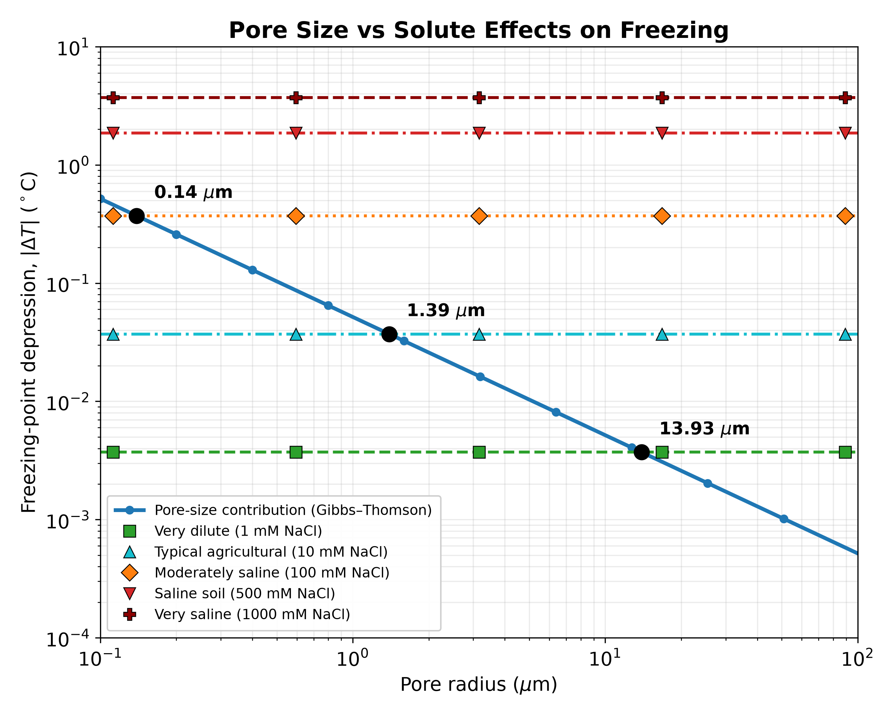

Water in soil does not all freeze at 0 °C. It freezes over a range of temperatures, **largest pores first**, and some of it never freezes at all. That unfrozen fraction is not a curiosity. It governs **how frozen ground conducts water and how much latent heat it stores**, and therefore how quickly a freezing front advances, how much water moves toward it, and how a permafrost table responds to a warm summer.

Three mechanisms keep that water liquid: capillarity, dissolved solutes, and adsorption on mineral surfaces. Each is well understood on its own, and each is usually described with a model drawn from a different literature. Our paper, now accepted in *Geotechnical and Geological Engineering*, asks a simple question: what happens if all three are derived from the same starting point?

***

## Three mechanisms, one chemical potential

The answer is that they stop being separate models. Writing the chemical potential of pore water as a single expression, the capillary (Gibbs–Thomson), osmotic (Raoult and van 't Hoff) and adsorptive contributions appear as three terms of one decomposition rather than three competing descriptions. We also state the condition under which they may simply be added, which is that they act on physically distinct water populations: bulk dissolved, capillary-meniscus, and adsorbed-film water.

That framing makes their relative sizes directly comparable, and the comparison is worth pausing on.

*Pore-size and solute contributions to freezing point depression. The blue curve is the Gibbs–Thomson effect; the horizontal lines are the osmotic depression for NaCl solutions. Black dots mark the pore radius that produces the same depression as each concentration.*

A pore of **0.14 µm** radius depresses the freezing point by as much as a **100 mM NaCl** solution. In saline soils the osmotic term is not a correction to capillarity. It leads.

## From the retention curve to the freezing curve

The same chemical potential links the soil water retention curve to the soil freezing characteristic curve, through the generalised Clausius–Clapeyron relation. The conversion factor is larger than intuition suggests: **one kelvin of freezing point depression is worth about 1.2 MPa of suction**, roughly 125 metres of pressure head.

The consequence is immediate. Within a fraction of a degree below zero, freezing has already carried the soil out of the capillary range and into the regime where adsorbed water films, not menisci, control retention. This is why capillary theory alone fails in clays, where liquid water persists far below the temperatures a Gibbs–Thomson argument would predict. Using a retention model that resolves adsorbed films, the resulting freezing curve then closes the energy budget: temperature, liquid water content and ice content all follow from a single conserved variable, the enthalpy.

## Assumptions that can be tested

Frameworks of this kind rest on assumptions that are usually left implicit: that each representative volume is internally at equilibrium, that water redistributes among pores instantaneously, and that freezing is equivalent to drying. Rather than list these as caveats, we express them as a timescale criterion that can be checked for a given soil and forcing, and we say where we expect it to fail: in dry or clay-rich soils, in saline pore water, and wherever supercooling or freeze–thaw hysteresis controls the response.

*The paper is theoretical. No new measurements are reported, and a companion paper will couple the framework to the Richards equation and confront it with measured freezing curves.*

### Read the Full Paper

Wani, J.M., D'Amato, C., Rigon, R. (2026). *The Tricky Water Energy Budget of Freezing Soil: A Thermodynamic Framework for Understanding Phase Changes.* Geotechnical and Geological Engineering. Accepted.
